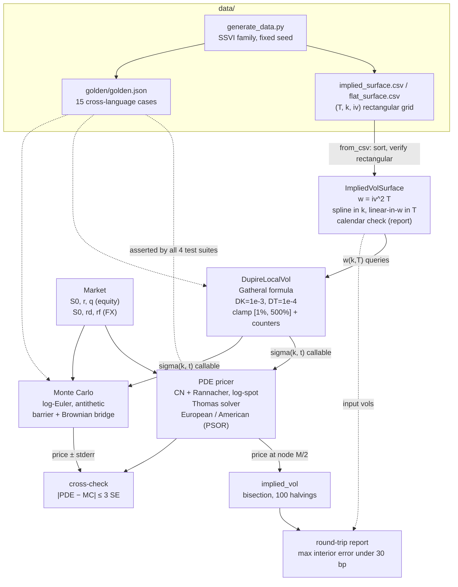
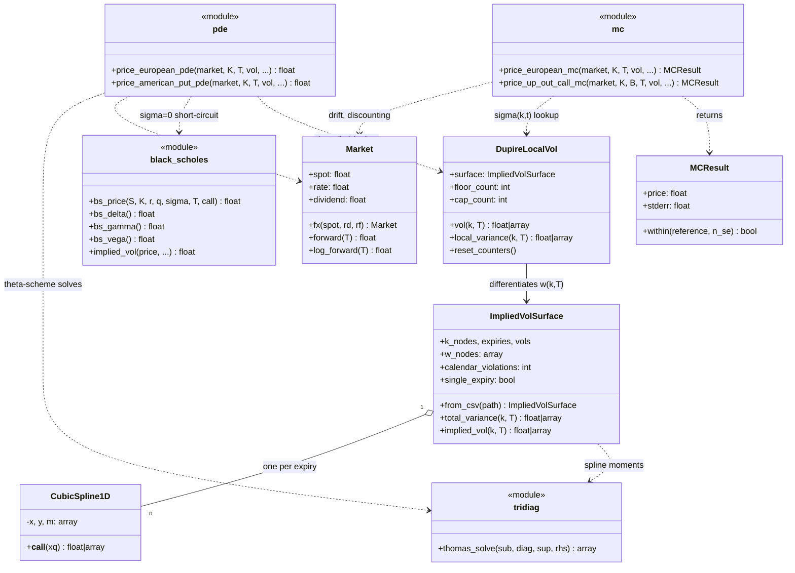
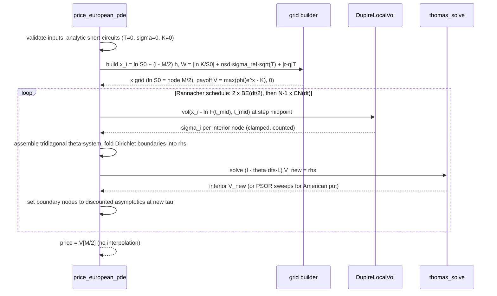

# localvol — Architecture

This document describes how the project is put together: what each component
owns, how data flows from CSV to price, the numerical decisions and their
trade-offs, error handling in each language, and how correctness is tested.
The language-neutral numerical contract lives in `../API_SPEC.md`; this
document explains the *why* behind that contract.

## 1. Components and responsibilities

| Component (Python module) | Responsibility | Depends on |
|---|---|---|
| `market` | `Market` value object: spot, rate, dividend (equity `r`/`q`, FX `rd`/`rf` via `Market.fx`); forward and log-forward | — |
| `tridiag` | `thomas_solve`: the single linear-algebra kernel (Thomas algorithm, pivot guard) | — |
| `black_scholes` | Closed-form BS/Garman-Kohlhagen price and Greeks; bisection implied vol with no-arbitrage bounds | — |
| `surface` | `CubicSpline1D` (natural spline) and `ImpliedVolSurface` (total-variance storage, interpolation/extrapolation rules, CSV loading, calendar-arbitrage counting) | `tridiag` |
| `dupire` | `DupireLocalVol`: Gatheral formula on fixed-step finite differences, clamping with floor/cap counters | `surface` |
| `pde` | European CN/Rannacher pricer and American-put PSOR variant; grid construction; boundary handling | `tridiag`, `market`, `black_scholes` |
| `mc` | Log-Euler Monte Carlo, antithetic estimator, up-and-out barrier with Brownian bridge | `market` |
| `data/generate_data.py` | Deterministic regeneration of surfaces and golden values; refuses to write goldens unless the reference passes self-validation | whole package |

The C++/Rust/Java ports mirror this decomposition one-to-one (namespace
`localvol`, crate `localvol`, package `com.quant.localvol`) so that a
numerical discrepancy can be localized to one component in any language.

Two deliberate seams keep the design flat:

* **The vol argument is a plain callable/value, not a hierarchy.** Both
  pricers accept either a flat vol or a `sigma(k, t)` function; `DupireLocalVol.vol`
  happens to have that shape. Engines therefore know nothing about surfaces,
  and a stochastic- or parametric-vol experiment can be plugged in without
  touching pricer code.
* **The surface is carry-free.** It lives in forward log-moneyness and total
  variance, so one CSV serves equity and FX; all carry enters through
  `Market` at lookup time (`k = x - ln F(t)`).

## 2. Data flow

The demo exercises the full loop: surface in, Dupire out, PDE reprice,
bisection back to implied vol, error report against the inputs — plus an
MC cross-check and American/barrier flavors. The round trip is the
project's strongest integration test because an error *anywhere* in the
chain (interpolation, differencing, PDE, inversion) shows up as basis
points of implied-vol error.

## 3. Class/module view

## 4. One PDE solve, step by step

## 5. Numerical design decisions and trade-offs

**Total variance + spline-in-k + linear-in-T.** Storing `w = iv^2 T` makes
calendar no-arbitrage a monotonicity property and lets linear time
interpolation preserve it for free. The natural cubic spline supplies the
`C^2` smoothness Dupire's `d2w/dk2` needs and is fully node-determined (no
tuning parameters), at the cost of potential overshoot on ragged data —
acceptable because the bundled surfaces are smooth by construction, and
noted in LEARN.md as a place where production systems substitute parametric
SVI fits. Trade-off accepted: the spline couples all strikes in a slice, so
one bad quote pollutes a whole expiry — mitigated by the clamp counters.

**Fixed-step finite differences for Dupire (`DK = 1e-3`, `DT = 1e-4`).**
Analytic spline differentiation was rejected in favor of fixed-step
differences on the *interpolated* surface because it makes the
cross-language contract trivial: any port that reproduces `w(k, T)` and the
two step sizes reproduces the golden local vols to < 1e-4 without matching
derivative code paths. The cost — an O(DK^2) differencing error — is far
below quoting noise.

**Clamp-and-count instead of raise.** Local vol is evaluated thousands of
times inside PDE/MC loops, frequently outside the quoted region (grid wings,
MC excursions). Raising there would make pricing fragile; silently flooring
would hide bad surfaces. The compromise: clamp to `[1%, 500%]`, count floor
and cap hits separately (they diagnose calendar vs butterfly problems), and
expose the counters for reporting. Same philosophy for calendar violations
(count + warn at build) and PSOR non-convergence (warn + proceed).

**Log-spot uniform grid with the spot as an exact node.** Uniform spacing
in `x = ln S` keeps coefficients well scaled, makes the Thomas systems
diagonally dominant under the mesh Péclet condition (guaranteed by the width
rule), and — because `ln S0` is node `M/2` by construction — removes final
interpolation error entirely. Trade-off: no local refinement around strike
or barrier; the width rule (`6 sigma_ref sqrt(T)` + strike + drift terms)
buys accuracy by brute width instead, which is fine at M = 200.

**Crank-Nicolson + Rannacher rather than plain CN or implicit.** Implicit
Euler is robust but first-order; CN is second-order but rings on kinked
payoffs (A-stable, not L-stable). The Rannacher start — the first dt
replaced by two backward-Euler half-steps — damps the kink-excited modes
while keeping global second order. This is verified, not assumed: tests
assert non-oscillatory gamma near the strike and an observed convergence
order in `[1.5, 2.5]` under simultaneous (dx, dt) halving.

**Frozen midpoint vol per time step.** Local vol is evaluated once per step
at the step's midpoint calendar time, per node. This is the standard
first-order-in-time freezing; the alternative (iterating the coefficient
within a step) costs another solve per iteration for negligible gain at
these grid sizes.

**PSOR for the American put.** Chosen over penalty/operator-splitting
because it solves the LCP to an explicit tolerance (`1e-8`) with no penalty
parameter, reuses the unmodified tridiagonal coefficients, and warm-starts
from the previous level. Trade-off: an interior Gauss-Seidel loop that does
not vectorize — acceptable at 200 nodes, and the natural place a production
system would swap in operator splitting.

**Log-Euler MC with start-of-step lookup and pair-mean antithetics.**
Euler on `ln S` preserves positivity; the start-of-step vol lookup matches
the PDE's coordinates exactly, so both engines discretize the same
diffusion. Antithetic standard errors are computed over pair means (raw-path
errors would be biased). The Brownian-bridge barrier weighting removes the
`O(sqrt(dt))` monitoring bias with zero extra random numbers, keeping every
run deterministic per seed.

**Bisection implied vol.** 100 halvings of `[1e-9, 5]` is slower than
Newton but derivative-free, immune to tiny wing vegas, and — crucial for
the golden framework — bit-comparable across languages.

## 6. Error-handling strategy per language

Policy (uniform across the project): **invalid input fails eagerly** with a
message naming the offending parameter; **data-quality and convergence
conditions are reported, never raised** (calendar violations, Dupire clamps,
PSOR non-convergence, single-expiry surfaces).

| Language | Invalid input | Reported conditions |
|---|---|---|
| Python | `raise ValueError("...")` | `warnings.warn(UserWarning / RuntimeWarning)` + counters/flags |
| C++ | `throw std::invalid_argument` (`std::domain_error` for domain violations) | log to `stderr` + counters/flags on the object |
| Rust | `Result<T, LocalVolError>` — manual thiserror-style enum, never panic on bad input | `eprintln!` log + counters/flags; `Ok` still returned |
| Java | `throw IllegalArgumentException` | logger/`System.err` + counters/flags |

Validation is at the *edges* (constructors and public entry points):
finiteness of every scalar, `spot > 0`, `strike >= 0`, grid monotonicity,
rectangular CSV grids, `num_space` even and >= 4, `omega` in `(0, 2)`,
no-arbitrage bounds in the implied-vol inverter, `|pivot| >= 1e-300` in
Thomas. Inner loops never re-validate — by construction they only receive
values that already passed.

## 7. Testing strategy

Four layers, mirrored in each language:

1. **Golden values** (`data/golden/golden.json`, 15 cases). Deterministic
   engines (Dupire, PDE) carry tight absolute tolerances (1e-6 flat-surface
   identity, 1e-4 local vols, 1e-3-relative-pre-multiplied PDE prices);
   MC cases carry 4-standard-error statistical tolerances so each language
   can keep its own fixed seed. The generator self-validates the Python
   reference (PDE vs closed-form BS, flat-surface Dupire identity) before it
   will write the file.
2. **Analytic anchors.** Flat-vol PDE vs Black-Scholes across equity/FX/
   negative-rate parameter sets; put-call parity on the grid; barrier MC vs
   the Reiner-Rubinstein closed form; American PSOR vs a 5000-step CRR
   binomial; flat-surface local vol == implied vol on a sweep of `(k, T)`.
3. **Property/structure tests.** Thomas vs an independent dense/banded solve
   on random tridiagonal systems (SciPy/Eigen allowed *only* here); spline
   exactness at nodes and continuity near nodes; interpolator monotonicity;
   Rannacher damping (bounded negative curvature of the price grid near the
   strike); observed convergence order in `[1.5, 2.5]`; American >= European;
   bridged barrier <= discrete barrier <= vanilla; antithetic estimator
   consistency.
4. **Edge/validation tests.** T = 0, sigma = 0, K = 0, negative rates,
   single-expiry warning, calendar-arb counting, extrapolation paths (k and
   T beyond the grid), clamp engagement on extreme skew, and rejection of
   malformed input in every public entry point.

The round-trip demo doubles as an end-to-end acceptance test with a stated
threshold (interior implied-vol error < 30 bp) and is asserted in the test
suite, not just printed.

## 8. Performance notes

* Everything is O(M·N) with tridiagonal solves: a 200x200 European PDE is
  ~200 Thomas solves of size 199 — well under a millisecond in the native
  ports, a few ms in NumPy-backed Python.
* The dominant Python cost in local-vol pricing is the Dupire lookup (five
  surface evaluations per query batch); it is vectorized over the whole
  interior node set per time step (one array call, not 199 scalar calls).
  Ports should preserve this batching.
* PSOR is the one intentionally scalar loop (Gauss-Seidel is sequential by
  nature). Warm starts keep typical iteration counts low; the 10k iteration
  cap is a reporting boundary, not a tuning target.
* MC is O(paths·steps) with per-step vectorized surface lookups; the
  Brownian-bridge weighting adds one `exp` per surviving path-step and no
  RNG draws. Golden MC settings (20k x 100/200) run in seconds everywhere;
  test suites deliberately stay at these sizes to hold the < 60 s/language
  budget on 2 CPUs.
* Memory is trivial: the largest live arrays are O(M) grid levels and
  O(paths) state vectors; nothing stores full path histories.
