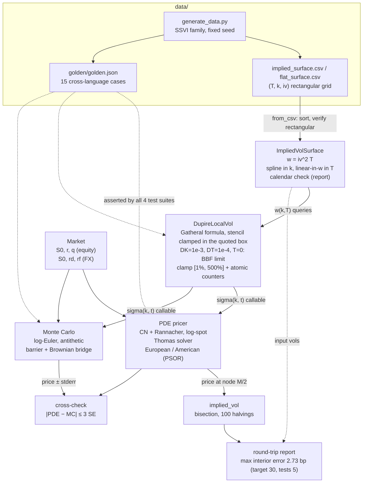
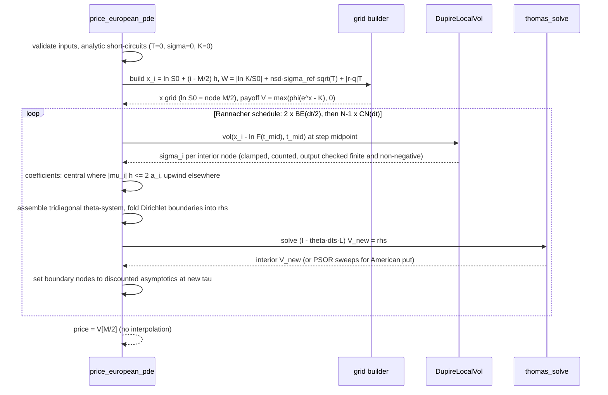

# localvol — Architecture

This document describes how the project is put together: what each component
owns, how data flows from CSV to price, the numerical decisions and their
trade-offs, error handling in each language, and how correctness is tested.
The language-neutral numerical contract lives in `../API_SPEC.md`; this
document explains the *why* behind that contract.

## 1. Components and responsibilities

| Component (Python module) | Responsibility | Depends on |
|---|---|---|
| `market` | `Market` value object: spot, rate, dividend (equity `r`/`q`, FX `rd`/`rf` via `Market.fx`); forward and log-forward | — |
| `tridiag` | `thomas_solve`: the single linear-algebra kernel (Thomas algorithm, pivot guard) | — |
| `black_scholes` | Closed-form BS/Garman-Kohlhagen price and Greeks; bisection implied vol with no-arbitrage bounds | — |
| `surface` | `CubicSpline1D` (natural spline) and `ImpliedVolSurface` (total-variance storage, interpolation/extrapolation rules, strict CSV loading, calendar-arbitrage and spline-overshoot counting) | `tridiag` |
| `dupire` | `DupireLocalVol`: Gatheral formula on fixed-step finite differences with the stencil clamped inside the quoted box, Berestycki-Busca-Florent limit at `T = 0`, clamping with thread-safe floor/cap counters | `surface` |
| `pde` | European CN/Rannacher pricer and American-put PSOR variant; grid construction; central/upwind coefficient switch; boundary handling; checked vol callables | `tridiag`, `market`, `black_scholes` |
| `mc` | Log-Euler Monte Carlo, antithetic estimator, up-and-out barrier with Brownian bridge; checked vol callables | `market` |
| `data/generate_data.py` | Deterministic regeneration of surfaces and golden values; refuses to write goldens unless the reference passes self-validation | whole package |

The C++/Rust/Java ports mirror this decomposition one-to-one (namespace
`localvol`, crate `localvol`, package `com.quant.localvol`) so that a
numerical discrepancy can be localized to one component in any language.

Two deliberate seams keep the design flat:

* **The vol argument is a plain callable/value, not a hierarchy.** Both
  pricers accept either a flat vol or a `sigma(k, t)` function; `DupireLocalVol.vol`
  happens to have that shape. Engines therefore know nothing about surfaces,
  and a stochastic- or parametric-vol experiment can be plugged in without
  touching pricer code.
* **The surface is carry-free.** It lives in forward log-moneyness and total
  variance, so one CSV serves equity and FX; all carry enters through
  `Market` at lookup time (`k = x - ln F(t)`).

## 2. Data flow

The demo exercises the full loop: surface in, Dupire out, PDE reprice,
bisection back to implied vol, error report against the inputs — plus an
MC cross-check and American/barrier flavors. The round trip is the
project's strongest integration test because an error *anywhere* in the
chain (interpolation, differencing, PDE, inversion) shows up as basis
points of implied-vol error.

## 3. Class/module view

## 4. One PDE solve, step by step

## 5. Numerical design decisions and trade-offs

**Total variance + spline-in-k + linear-in-T.** Storing `w = iv^2 T` makes
calendar no-arbitrage a monotonicity property and lets linear time
interpolation preserve it for free. The natural cubic spline supplies the
`C^2` smoothness Dupire's `d2w/dk2` needs *inside* the quoted box and is
fully node-determined (no tuning parameters), at the cost of potential
overshoot on ragged data — the surface scans every node interval at build
time and reports dips to `w <= 0` (`negative_w_count`), and LEARN.md notes
that production systems substitute parametric SVI fits. Two consequences
of these choices are documented rather than hidden: linear-in-`w` time
interpolation makes the forward variance piecewise constant, so local vol
*jumps* at every pillar (the goldens sit 1e-3 off the pillars for that
reason); and flat wing extrapolation leaves `w` only `C^0` at the last
quoted strike (natural spline: `w'' = 0` but `w' != 0`). Trade-off
accepted: the spline couples all strikes in a slice, so one bad quote
pollutes a whole expiry — mitigated by the counters.

**Fixed-step finite differences for Dupire (`DK = 1e-3`, `DT = 1e-4`),
stencil clamped in the box.** Analytic spline differentiation was rejected
in favor of fixed-step differences on the *interpolated* surface because it
makes the cross-language contract trivial: any port that reproduces
`w(k, T)` and the two step sizes reproduces the golden local vols to < 1e-4
without matching derivative code paths. The cost — an O(DK^2) differencing
error — is far below quoting noise. The stencil must not straddle the wing
kink, though: doing so reads `d2w/dk2 ~ -w'/DK`, drives the denominator
negative and caps the vol at 500% *at the quoted wing* (2.5 sd from ATM on
the bundled surface), which cost 13 of a former 16 bp round-trip error. The
query point is therefore clamped into `[k_min + DK, k_max - DK]` before
differencing and used in every term; local vol is then constant in `k`
beyond `k_max - DK`, continuous across the wing, and the demo's counters
read zero. At `T = 0` the formula is `0/0`; `vol(k, 0)` is defined as the
Berestycki-Busca-Florent limit `s / (1 - k s'/s)` so the surface is
continuous with `T -> 0+`.

**Clamp-and-count instead of raise.** Local vol is evaluated thousands of
times inside PDE/MC loops, frequently outside the quoted region (grid wings,
MC excursions). Raising there would make pricing fragile; silently flooring
would hide bad surfaces. The compromise: clamp to `[1%, 500%]`, count floor
and cap hits separately (they diagnose calendar vs butterfly problems), and
expose the counters for reporting. Same philosophy for calendar violations
(count + warn at build) and PSOR non-convergence (warn + proceed).

**Log-spot uniform grid with the spot as an exact node.** Uniform spacing
in `x = ln S` keeps coefficients well scaled and — because `ln S0` is node
`M/2` by construction — removes final interpolation error entirely.
Trade-off: no local refinement around strike or barrier; the width rule
(`6 sigma_ref sqrt(T)` + strike + drift terms) buys accuracy by brute width
instead, which is fine at M = 200.

**Central differencing with a node-wise upwind fallback.** The Thomas
systems are diagonally dominant M-matrices only while the mesh Péclet
condition `|mu_i| h <= 2 a_i` holds at every node. The width rule uses
`sigma_ref` but each node uses its own `sigma_i`, so the condition is
*not* guaranteed under local vol: a node floored at 1% by the Dupire clamp
with 1-5% of carry violates it (as does a 1% flat vol with 10% carry), and
central differencing then produces non-monotone grids and negative put
prices (measured: -3e-6 with grid values down to -0.08). Rather than warn,
every node that fails the condition switches to first-order upwind for
the drift term, which keeps both off-diagonals >= 0 and the row sum `-r`
at the cost of `O(|mu| h / 2)` numerical diffusion *at those nodes only*;
nodes that satisfy the condition are bit-identical to plain central
differencing, so flat-vol goldens are unaffected.

**Crank-Nicolson + Rannacher rather than plain CN or implicit.** Implicit
Euler is robust but first-order; CN is second-order but rings on kinked
payoffs (A-stable, not L-stable). The Rannacher start — the first dt
replaced by two backward-Euler half-steps — damps the kink-excited modes
while keeping global second order for the *price*. This is verified, not
assumed: tests assert non-oscillatory gamma near the strike and an observed
convergence order in `[1.5, 2.5]` under simultaneous (dx, dt) halving (and
`[0.8, 2.5]` under local vol, where the frozen coefficient is formally first
order in time). Documented divergence from Giles-Carter (2006): they
recommend four half-steps so that delta and gamma at the kink are second
order too; with two, the Greeks retain an O(dt) component. The goldens pin
prices, so two were kept.

**Frozen midpoint vol per time step.** Local vol is evaluated once per step
at the step's midpoint calendar time, per node. This is the standard
first-order-in-time freezing; the alternative (iterating the coefficient
within a step) costs another solve per iteration for negligible gain at
these grid sizes.

**PSOR for the American put.** Chosen over penalty/operator-splitting
because it solves the LCP to an explicit tolerance (`1e-8`) with no penalty
parameter, reuses the unmodified tridiagonal coefficients, and warm-starts
from the previous level. Trade-off: an interior Gauss-Seidel loop that does
not vectorize — acceptable at 200 nodes, and the natural place a production
system would swap in operator splitting.

**Log-Euler MC with start-of-step lookup and pair-mean antithetics.**
Euler on `ln S` preserves positivity; the start-of-step vol lookup matches
the PDE's coordinates exactly, so both engines discretize the same
diffusion — and the suites exercise it with `r != q` so a `ln S0` lookup
would be caught. Antithetic standard errors are computed over pair means
(raw-path errors would be biased); at least two pair means (`n_paths >= 4`)
are required because the `ddof = 1` error of a single sample is `0/0`. The
Brownian-bridge barrier weighting removes the `O(sqrt(dt))` monitoring bias
with zero extra random numbers, keeping every run deterministic per seed
and toolchain (the generators differ per language and are named in
API_SPEC §7).

**Bisection implied vol.** 100 halvings of `[1e-9, 5]` is slower than
Newton but derivative-free, immune to tiny wing vegas, and — crucial for
the golden framework — bit-comparable across languages.

## 6. Error-handling strategy per language

Policy (uniform across the project): **invalid input fails eagerly** with a
message naming the offending parameter; **data-quality and convergence
conditions are reported, never raised** (calendar violations, Dupire clamps,
PSOR non-convergence, single-expiry surfaces).

| Language | Invalid input | Reported conditions |
|---|---|---|
| Python | `raise ValueError("...")` | `warnings.warn(UserWarning / RuntimeWarning)` + counters/flags |
| C++ | `throw std::invalid_argument` (`std::domain_error` for domain violations) | log to `stderr` + counters/flags on the object |
| Rust | `Result<T, LocalVolError>` — manual thiserror-style enum, never panic on bad input | `eprintln!` log + counters/flags; `Ok` still returned |
| Java | `throw IllegalArgumentException` | logger/`System.err` + counters/flags |

Validation is at the *edges* (constructors and public entry points):
finiteness of every scalar, `spot > 0`, `strike >= 0`, grid monotonicity,
rectangular CSV grids with no duplicate `(T, k)`, `num_space` even and
>= 4, `omega` in `(0, 2)`, `tol` finite and > 0, `n_paths >= 4` (antithetic)
/ `>= 2`, no-arbitrage bounds in the implied-vol inverter, bisection
bracket `0 < lo < hi`, `|pivot| >= 1e-300` in Thomas. The one thing the
inner loops *do* check is the output of a user-supplied vol callable
(Python, C++, Java): a NaN, infinite or negative sigma is rejected at the
lookup instead of surfacing as a NaN price or an opaque solver error. Rust
needs no such check — `VolInput` is a closed enum.

**Thread contract.** `ImpliedVolSurface` is immutable after construction.
`DupireLocalVol.vol()` is safe to call concurrently on one shared object:
the clamp counters are `std::atomic<long>` (C++), `AtomicU64` (Rust —
the type is `Send + Sync`, verified by a compile-time test) and
`LongAdder` (Java), incremented with relaxed ordering; their total is exact
(asserted by a 4-thread test in C++ and Java) while a read taken during a
concurrent sweep is a snapshot. `reset_counters()` belongs between phases.
The C++ object holds a *reference* to the surface and deletes the
`ImpliedVolSurface&&` constructor, so binding a temporary is a compile
error rather than a dangling reference. Pricer entry points are pure
functions of their arguments and reentrant. The Python reference is
single-threaded.

## 7. Testing strategy

Four layers, mirrored in each language:

1. **Golden values** (`data/golden/golden.json`, 15 cases). Deterministic
   engines (Dupire, PDE) carry tight absolute tolerances (1e-6 flat-surface
   identity, 1e-4 local vols, 1e-3-relative-pre-multiplied PDE prices);
   MC cases carry 4-standard-error statistical tolerances so each language
   can keep its own fixed seed. The generator self-validates the Python
   reference (PDE vs closed-form BS, flat-surface Dupire identity, no clamp
   anywhere in the quoted box, continuity at the wings) before it will
   write the file. The three `dupire_bundled_*` cases near pillars sit
   1e-3 off them.
2. **Analytic anchors.** Flat-vol PDE vs Black-Scholes across equity/FX/
   negative-rate parameter sets; put-call parity on the grid and under
   local-vol MC; barrier MC vs the Reiner-Rubinstein closed form; American
   PSOR vs a 5000-step CRR binomial; flat-surface local vol == implied vol
   on a sweep of `(k, T)`; a flat-in-k term-structure surface whose local
   variance must equal the forward variance exactly and reprice through the
   PDE within 3 bp; `vol(k, 0)` vs an independent BBF evaluation; the
   upwind coefficient rule vs its closed form.
3. **Property/structure tests.** Thomas vs an independent dense/banded solve
   on random tridiagonal systems (SciPy/Eigen allowed *only* here); spline
   exactness at nodes and continuity near nodes; interpolator monotonicity;
   Rannacher damping (bounded negative curvature of the price grid near the
   strike); observed convergence order in `[1.5, 2.5]` (flat) and
   `[0.8, 2.5]` (local vol vs a 400x400 reference); American >= European;
   deep-ITM American == intrinsic; American == European at negative rates;
   bridged barrier <= discrete barrier <= vanilla; antithetic estimator
   consistency; local-vol MC vs PDE within 3 SE *with carry* (equity
   `r = 5%, q = 2%` and FX with a negative foreign rate); no clamp anywhere
   in the quoted box and continuity across the wings; `vol(k, 0)`
   continuous with `T -> 0+`; Péclet-violating grids stay non-negative and
   monotone; determinism of PDE and MC per seed; counter exactness under
   four threads (C++, Java) and `Send + Sync` (Rust).
4. **Edge/validation tests.** T = 0, sigma = 0, K = 0, negative rates,
   single-expiry warning, calendar-arb and spline-overshoot counting,
   extrapolation paths (k and T beyond the grid), clamp engagement on
   extreme skew at `T > 0` and `T = 0`, PSOR non-convergence (warning
   captured, finite result), and rejection of malformed input in every
   public entry point: NaN `tol`, tiny `n_paths`, NaN/negative vol
   callables, bad bisection brackets, negative `log_forward` expiries, and
   CSV files with duplicate, missing, short, long, non-numeric or non-finite
   rows (written to temp files by the tests).

The round-trip demo doubles as an end-to-end acceptance test: the demo's
full 4 x 7 grid is asserted in **all four** suites (`test_roundtrip.py`,
`test_roundtrip.cpp`, `roundtrip_tests.rs`, `RoundTripTest.java`) to stay
under 5 bp (spec target 30 bp; measured 2.73 bp) with zero clamps. Test
counts: Python 90, C++ 72, Rust 73, Java 70. The COOKBOOK's 47 snippets
are extracted and compiled/run against the libraries as a documentation
check.

## 8. Performance notes

Measured on the 2-core review machine (C++ `-O2`; Rust and Java are the
same order of magnitude):

* Everything is O(M·N) with tridiagonal solves: a 200x200 European PDE is
  201 Thomas solves of size 199 (the Rannacher start adds one) — 0.7 ms
  flat and ~5 ms under local vol in C++ (the ~40k Dupire evaluations, each
  five spline lookups with a binary search, dominate); ~50 ms / ~115 ms in
  NumPy-backed Python.
* The dominant Python cost in local-vol pricing is the Dupire lookup; it is
  vectorized over the whole interior node set per time step (one array
  call, not 199 scalar calls). Ports batch the same way through a scalar
  loop.
* PSOR is the one intentionally scalar loop (Gauss-Seidel is sequential by
  nature). Warm starts keep typical iteration counts low; the 10k iteration
  cap is a reporting boundary, not a tuning target.
* MC is O(paths·steps) with per-step vectorized surface lookups; the
  Brownian-bridge weighting adds one `exp` per surviving path-step and no
  RNG draws. The 20k x 100 local-vol MC takes ~0.26 s in C++ and ~1.2 s in
  Python. Whole suites: Python ~13 s, C++ ~2 s, Rust ~2 s, Java ~3 s.
* Memory is trivial: the largest live arrays are O(M) grid levels and
  O(paths) state vectors; nothing stores full path histories.
